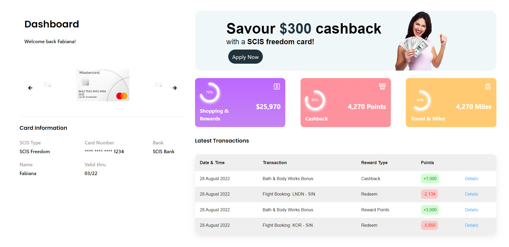

# Ascent

## Overview
With heightened expectations from digital natives today who would take their business elsewhere if unsatisfied, it has become more important than ever for businesses to utilise loyalty programs to increase customer retention. 

*Ascenda Loyalty* aims to provide banks with a loyalty points processing platform for their customers across a variety of card programs. Our solution, **Ascent**, allows banks and merchants to
Process millions of transactions with specific spending rules for different card types taken into consideration 
Flexibly launch and manage marketing campaigns
Showcase rewards accrued by users in the form of cashback, miles, and points in relation to their spending 

## Screenshots

  
  

## Running the application (frontend)
Running `npm run dev` in the frontend folder runs the frontend in the development mode.\
Open [http://localhost:5137](http://localhost:5137) to view it in your browser.
